<div class="absolute inset-0 bg-[#0b1220]"></div>

<div class="relative z-10">

<div class="flex justify-center mb-6">
  <ph:flow-arrow-duotone class="text-8xl text-teal-400" />
</div>

# Mermaid

<div class="text-2xl font-light opacity-80 -mt-2">
從零開始的圖表語法課
</div>

<div class="pt-10 flex justify-center gap-8 text-sm opacity-70">
  <div class="flex items-center gap-2">
    <ph:flow-arrow class="text-lg" />
    <span>Flowchart</span>
  </div>
  <div class="flex items-center gap-2">
    <ph:calendar-dots class="text-lg" />
    <span>Gantt</span>
  </div>
  <div class="flex items-center gap-2">
    <ph:tree-structure class="text-lg" />
    <span>Mindmap</span>
  </div>
  <div class="flex items-center gap-2">
    <ph:chart-pie-slice class="text-lg" />
    <span>Pie</span>
  </div>
</div>

<div class="pt-20 text-xs opacity-50 tracking-widest">
  按 <kbd class="border border-white/20 rounded px-1.5 py-0.5">Space</kbd> 開始
</div>

</div>

<style>
h1 {
  font-size: 7rem !important;
  font-weight: 800;
  letter-spacing: -0.04em;
  color: #f1f5f9;
  line-height: 1;
}
</style>

---
layout: two-cols-header
---

# 課程地圖

<div class="text-sm opacity-60">這堂課會帶你走過的四個階段</div>

::left::

<div class="pr-4 space-y-3 pt-4">

<div class="flex items-center gap-4 p-3 rounded-lg bg-white/5 border-l-2 border-teal-400">
  <ph:number-circle-one-duotone class="text-4xl text-teal-400 shrink-0" />
  <div>
    <div class="font-bold">認識 Mermaid</div>
    <div class="text-xs opacity-60">為什麼值得學</div>
  </div>
</div>

<div class="flex items-center gap-4 p-3 rounded-lg bg-white/5 border-l-2 border-sky-400">
  <ph:number-circle-two-duotone class="text-4xl text-sky-400 shrink-0" />
  <div>
    <div class="font-bold">Flowchart 流程圖</div>
    <div class="text-xs opacity-60">主力單元</div>
  </div>
</div>

</div>

::right::

<div class="pl-4 space-y-3 pt-4">

<div class="flex items-center gap-4 p-3 rounded-lg bg-white/5 border-l-2 border-amber-400">
  <ph:number-circle-three-duotone class="text-4xl text-amber-400 shrink-0" />
  <div>
    <div class="font-bold">Gantt 甘特圖</div>
    <div class="text-xs opacity-60">專案排程</div>
  </div>
</div>

<div class="flex items-center gap-4 p-3 rounded-lg bg-white/5 border-l-2 border-rose-400">
  <ph:number-circle-four-duotone class="text-4xl text-rose-400 shrink-0" />
  <div>
    <div class="font-bold">Mindmap &amp; Pie</div>
    <div class="text-xs opacity-60">心智圖與圓餅圖</div>
  </div>
</div>

</div>

---
layout: section
class: text-left
---

<div class="text-teal-400 text-xs tracking-[0.3em] mb-4 font-mono">CHAPTER · 01</div>

# 認識 Mermaid

<div class="text-lg opacity-60 mt-4 font-light">
一種用「寫字」畫圖的語言
</div>

<div class="absolute bottom-10 right-10 opacity-20">
  <ph:flow-arrow-duotone class="text-[16rem] text-teal-400" />
</div>

---
layout: statement
---

<div class="text-3xl font-light leading-relaxed max-w-3xl">
如果你能用<span class="text-teal-400 font-medium">五行文字</span>，<br>
畫出一張會自己排版的流程圖 —
</div>

<div class="text-lg opacity-60 mt-10 font-mono">
這就是 Mermaid 在做的事。
</div>

---

# 傳統工具 vs. Mermaid

<div class="grid grid-cols-2 gap-6 pt-6">

<div class="p-5 rounded-lg bg-white/[0.03] border border-white/10">

<div class="flex items-center gap-3 mb-4">
  <ph:cursor-click-duotone class="text-3xl text-red-300" />
  <div>
    <div class="text-red-300 text-xs tracking-widest uppercase font-mono">Traditional</div>
    <div class="font-bold">PowerPoint · Visio · draw.io</div>
  </div>
</div>

<div class="h-px bg-white/10 mb-4"></div>

<ul class="text-sm space-y-2 opacity-80">
  <li>要用滑鼠拉方塊、連線</li>
  <li>改一個節點就要重排版</li>
  <li>無法 git diff 比對差異</li>
  <li>截圖貼到文件很快就過期</li>
</ul>

</div>

<div class="p-5 rounded-lg bg-teal-500/[0.05] border border-teal-500/30">

<div class="flex items-center gap-3 mb-4">
  <ph:code-duotone class="text-3xl text-teal-300" />
  <div>
    <div class="text-teal-300 text-xs tracking-widest uppercase font-mono">Mermaid</div>
    <div class="font-bold">寫純文字</div>
  </div>
</div>

<div class="h-px bg-teal-500/20 mb-4"></div>

<ul class="text-sm space-y-2 opacity-80">
  <li>幾行程式碼就產生一張圖</li>
  <li>改文字，圖自動重排</li>
  <li>可以用 git diff 看差異</li>
  <li>GitHub / Notion / VSCode 原生渲染</li>
</ul>

</div>

</div>

---
layout: image-right
image: https://images.unsplash.com/photo-1522542550221-31fd19575a2d?w=1200&q=80
---

# Mermaid 能畫什麼？

<div class="text-sm opacity-60 pb-6">
支援十幾種圖表，這堂課聚焦四種最常用的
</div>

<div class="space-y-3 pr-6">

<div class="flex items-center gap-4 p-3 rounded-lg bg-white/[0.03] border border-white/10">
  <ph:flow-arrow-duotone class="text-3xl text-sky-400 shrink-0" />
  <div>
    <div class="font-bold text-sm">Flowchart</div>
    <div class="text-xs opacity-60">流程圖 — 最常用</div>
  </div>
</div>

<div class="flex items-center gap-4 p-3 rounded-lg bg-white/[0.03] border border-white/10">
  <ph:calendar-dots-duotone class="text-3xl text-amber-400 shrink-0" />
  <div>
    <div class="font-bold text-sm">Gantt</div>
    <div class="text-xs opacity-60">甘特圖 — 專案排程</div>
  </div>
</div>

<div class="flex items-center gap-4 p-3 rounded-lg bg-white/[0.03] border border-white/10">
  <ph:tree-structure-duotone class="text-3xl text-purple-400 shrink-0" />
  <div>
    <div class="font-bold text-sm">Mindmap</div>
    <div class="text-xs opacity-60">心智圖 — 腦力激盪</div>
  </div>
</div>

<div class="flex items-center gap-4 p-3 rounded-lg bg-white/[0.03] border border-white/10">
  <ph:chart-pie-slice-duotone class="text-3xl text-rose-400 shrink-0" />
  <div>
    <div class="font-bold text-sm">Pie</div>
    <div class="text-xs opacity-60">圓餅圖 — 比例視覺化</div>
  </div>
</div>

</div>

---

# 在 Slidev 中使用 Mermaid

<div class="text-sm opacity-60 pb-2">
只要在 Markdown 裡寫一個 <code>mermaid</code> 程式碼區塊
</div>

<div class="grid grid-cols-2 gap-6 pt-4">

<div>

<div class="text-xs tracking-widest text-teal-300 uppercase mb-2 font-mono">
  <ph:pencil-simple-duotone class="inline mr-1" />Input · 你寫的
</div>

````md
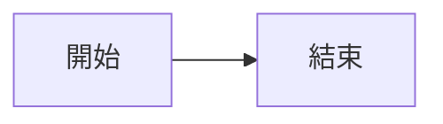
````

<div class="pt-6 text-sm">

<div class="text-xs tracking-widest text-amber-300 uppercase mb-2 font-mono">
  <ph:sliders-duotone class="inline mr-1" />Options · 可選
</div>

```
{theme: 'neutral', scale: 0.8}
```

控制外觀與大小。

</div>

</div>

<div>

<div class="text-xs tracking-widest text-teal-300 uppercase mb-2 font-mono">
  <ph:eye-duotone class="inline mr-1" />Output · 就變成
</div>

<div class="p-4 rounded-lg border border-teal-500/30 bg-teal-500/[0.05]">


</div>

</div>

</div>

---
layout: section
class: text-left
---

<div class="text-sky-400 text-xs tracking-[0.3em] mb-4 font-mono">CHAPTER · 02</div>

# Flowchart

<div class="text-lg opacity-60 mt-4 font-light">
流程圖 — 最重要、最常用的 Mermaid 圖表
</div>

<div class="absolute bottom-10 right-10 opacity-20">
  <ph:tree-view-duotone class="text-[16rem] text-sky-400" />
</div>

---

# 方向：由上而下？還是由左至右？

<div class="text-sm opacity-60 pb-3">
第一行決定整張圖的走向：<code>graph</code> + 方向代碼
</div>

<div class="grid grid-cols-2 gap-6">

<div class="min-w-0 overflow-hidden p-4 rounded-lg border border-sky-500/30 bg-sky-500/[0.03]">

<div class="flex items-center gap-2 pb-2">
  <div class="text-xs font-mono px-2 py-0.5 rounded bg-sky-500/20 text-sky-300">TD</div>
  <div class="text-xs opacity-60">Top-Down · 由上而下</div>
</div>

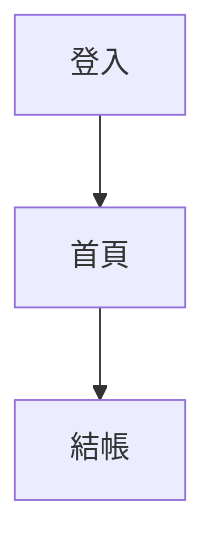

</div>

<div class="min-w-0 overflow-hidden p-4 rounded-lg border border-purple-500/30 bg-purple-500/[0.03]">

<div class="flex items-center gap-2 pb-2">
  <div class="text-xs font-mono px-2 py-0.5 rounded bg-purple-500/20 text-purple-300">LR</div>
  <div class="text-xs opacity-60">Left-Right · 由左至右</div>
</div>

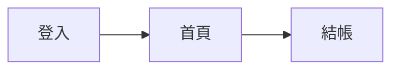

</div>

</div>

<div class="pt-6 text-xs opacity-50 text-center font-mono">
其他方向：<kbd>BT</kbd> 下而上 · <kbd>RL</kbd> 右而左
</div>

---

# 節點的形狀

<div class="text-sm opacity-60 pb-2">用不同的括號，畫出不同形狀</div>

<div class="p-3 rounded-lg border border-white/10 bg-white/[0.03] mb-3">

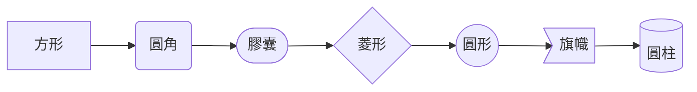

</div>

<div class="grid grid-cols-7 gap-2 text-xs text-center">
  <div class="p-2 rounded bg-white/[0.03] border border-white/10"><code>[ ]</code><div class="text-[10px] opacity-60 pt-0.5">一般步驟</div></div>
  <div class="p-2 rounded bg-white/[0.03] border border-white/10"><code>( )</code><div class="text-[10px] opacity-60 pt-0.5">柔和步驟</div></div>
  <div class="p-2 rounded bg-white/[0.03] border border-white/10"><code>([ ])</code><div class="text-[10px] opacity-60 pt-0.5">起點/終點</div></div>
  <div class="p-2 rounded bg-amber-500/10 border border-amber-500/30"><code>{ }</code><div class="text-[10px] opacity-60 pt-0.5"><b>判斷</b></div></div>
  <div class="p-2 rounded bg-white/[0.03] border border-white/10"><code>(( ))</code><div class="text-[10px] opacity-60 pt-0.5">圓圈</div></div>
  <div class="p-2 rounded bg-white/[0.03] border border-white/10"><code>&gt; ]</code><div class="text-[10px] opacity-60 pt-0.5">旗幟</div></div>
  <div class="p-2 rounded bg-white/[0.03] border border-white/10"><code>[( )]</code><div class="text-[10px] opacity-60 pt-0.5">資料庫</div></div>
</div>

---

# 連線的樣式

<div class="text-sm opacity-60 pb-3">箭頭有多種畫法，還能帶「文字標籤」</div>

<div class="grid grid-cols-2 gap-6">

<div class="min-w-0 overflow-hidden p-4 rounded-lg border border-white/10 bg-white/[0.03] flex items-center justify-center">

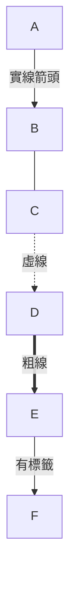

</div>

<div class="min-w-0 text-sm space-y-2">

<div class="flex gap-3 p-2 rounded bg-white/[0.03] border border-white/10">
  <code class="text-teal-300 w-24 shrink-0">--&gt;</code>
  <div>實線箭頭</div>
</div>

<div class="flex gap-3 p-2 rounded bg-white/[0.03] border border-white/10">
  <code class="text-teal-300 w-24 shrink-0">---</code>
  <div>實線、無箭頭</div>
</div>

<div class="flex gap-3 p-2 rounded bg-white/[0.03] border border-white/10">
  <code class="text-teal-300 w-24 shrink-0">-.-&gt;</code>
  <div>虛線</div>
</div>

<div class="flex gap-3 p-2 rounded bg-white/[0.03] border border-white/10">
  <code class="text-teal-300 w-24 shrink-0">==&gt;</code>
  <div>粗線（強調）</div>
</div>

<div class="flex gap-3 p-2 rounded bg-amber-500/10 border border-amber-500/30">
  <code class="text-amber-300 w-24 shrink-0">--&gt;&#124;text&#124;</code>
  <div>箭頭上加文字</div>
</div>

</div>

</div>

<div class="text-xs opacity-60 pt-3 text-center flex items-center justify-center gap-2">
  <ph:lightbulb-duotone />判斷節點（菱形）搭配帶標籤的箭頭最實用
</div>

---
layout: fact
---

# 6 行

<div class="text-lg opacity-60 mt-4 font-light max-w-2xl mx-auto">
接下來你會看到 — 一個完整的使用者登入流程圖<br>
只需要 6 行 Mermaid 程式碼
</div>

---

# 實戰範例：使用者登入流程

<div class="text-sm opacity-60 pb-3">左邊是原始碼（按空白鍵逐行解說），右邊是實際產生的流程圖</div>

<div class="grid grid-cols-2 gap-6">

<div>

```yaml {all|1|2|3|4|5|6|7|all}
graph TD
  A(["使用者開啟 App"]) --> B["輸入帳號密碼"]
  B --> C{"驗證通過?"}
  C -->|是| D["進入首頁"]
  C -->|否| E["顯示錯誤訊息"]
  E --> B
  D --> F(["結束"])
```

<div class="pt-3 min-h-[9rem]">

<div v-click="[1,2]" class="p-2 rounded-lg bg-white/[0.03] border-l-2 border-teal-400 text-xs">
<code class="text-teal-300">graph TD</code>
<span class="opacity-70 pl-2">宣告流程圖，方向由上而下</span>
</div>

<div v-click="[2,3]" class="p-2 rounded-lg bg-white/[0.03] border-l-2 border-sky-400 text-xs">
<code class="text-sky-300">A(["..."]) --> B["..."]</code>
<span class="opacity-70 pl-2">起點（膠囊）連到一般步驟</span>
</div>

<div v-click="[3,4]" class="p-2 rounded-lg bg-white/[0.03] border-l-2 border-amber-400 text-xs">
<code class="text-amber-300">B --> C&#123;"..."&#125;</code>
<span class="opacity-70 pl-2">連到菱形 — 判斷節點</span>
</div>

<div v-click="[4,6]" class="p-2 rounded-lg bg-white/[0.03] border-l-2 border-emerald-400 text-xs">
<code class="text-emerald-300">C --&gt;&#124;是&#124; D</code> / <code class="text-rose-300">&#124;否&#124; E</code>
<span class="opacity-70 pl-2">兩條帶標籤的分支</span>
</div>

<div v-click="[6,7]" class="p-2 rounded-lg bg-white/[0.03] border-l-2 border-rose-400 text-xs">
<code class="text-rose-300">E --> B</code>
<span class="opacity-70 pl-2">錯誤回到輸入 — 形成迴圈</span>
</div>

<div v-click="[7,8]" class="p-2 rounded-lg bg-white/[0.03] border-l-2 border-purple-400 text-xs">
<code class="text-purple-300">D --> F([...])</code>
<span class="opacity-70 pl-2">終點（膠囊）</span>
</div>

</div>

</div>

<div class="min-w-0 overflow-hidden p-4 rounded-lg border border-emerald-500/30 bg-emerald-500/[0.03] flex items-center justify-center">

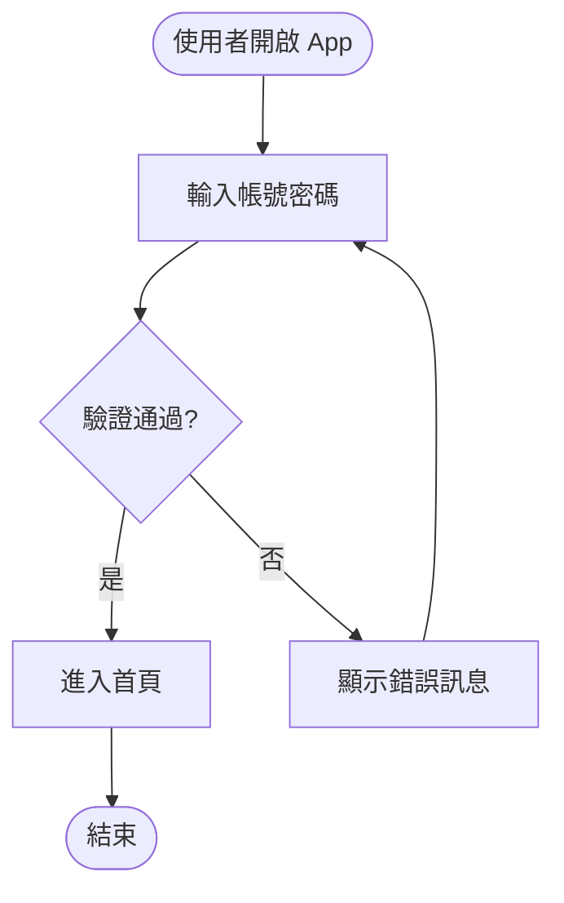

</div>

</div>

---

# 用 subgraph 把節點分組

<div class="text-sm opacity-60 pb-3">
當圖變複雜時，用 <code>subgraph</code> 把相關節點框起來
</div>

<div class="grid grid-cols-2 gap-6">

<div class="min-w-0 overflow-hidden p-4 rounded-lg border border-white/10 bg-white/[0.03]">

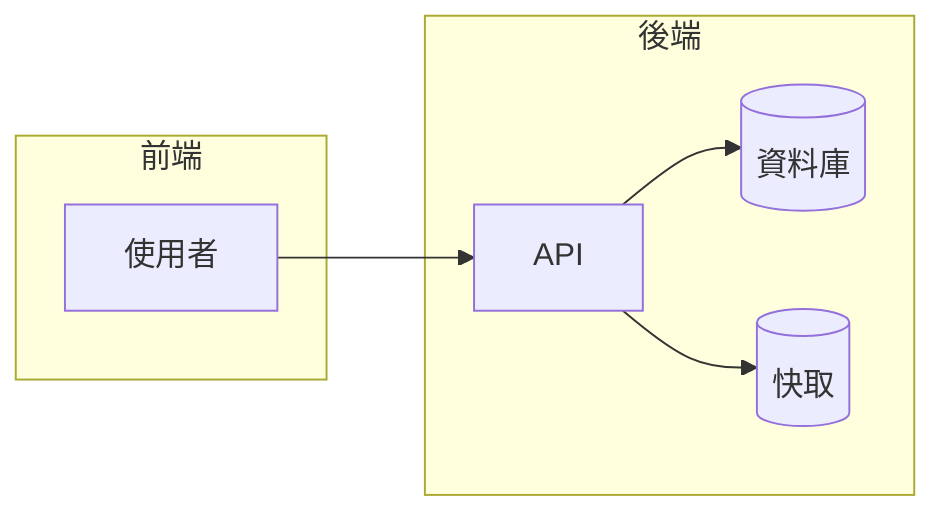

</div>

<div class="space-y-3 pt-2 text-sm">

<div class="p-3 rounded-lg bg-sky-500/[0.05] border-l-2 border-sky-500">
<div class="font-mono text-xs text-sky-300 pb-1">SYNTAX</div>
<code>subgraph 名稱</code> ... <code>end</code>
</div>

<div class="p-3 rounded-lg bg-purple-500/[0.05] border-l-2 border-purple-500">
<div class="font-mono text-xs text-purple-300 pb-1">USE CASE</div>
適合畫系統架構圖
</div>

<div class="p-3 rounded-lg bg-emerald-500/[0.05] border-l-2 border-emerald-500">
<div class="font-mono text-xs text-emerald-300 pb-1">BONUS</div>
分組會自動加上邊框與標題
</div>

</div>

</div>

---

# 用樣式讓圖更有表達力

<div class="text-sm opacity-60 pb-3">
<code>classDef</code> 定義樣式，<code>class</code> 套用到節點
</div>

<div class="grid grid-cols-2 gap-6">

<div class="min-w-0 overflow-hidden p-4 rounded-lg border border-white/10 bg-white/[0.03]">

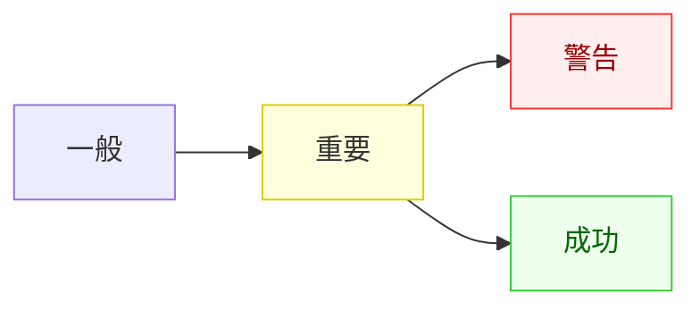

</div>

<div class="text-sm">

<div class="text-xs tracking-widest text-amber-300 uppercase pb-2 font-mono">Syntax</div>

```
classDef 名稱 css樣式
class 節點 樣式名
```

<div class="text-xs tracking-widest text-amber-300 uppercase pb-2 pt-4 font-mono">Supported Properties</div>

<div class="grid grid-cols-2 gap-2">
  <div class="px-2 py-1 rounded bg-white/[0.03] border border-white/10 text-xs"><code>fill</code> 填色</div>
  <div class="px-2 py-1 rounded bg-white/[0.03] border border-white/10 text-xs"><code>stroke</code> 邊框色</div>
  <div class="px-2 py-1 rounded bg-white/[0.03] border border-white/10 text-xs"><code>color</code> 字色</div>
  <div class="px-2 py-1 rounded bg-white/[0.03] border border-white/10 text-xs"><code>stroke-width</code></div>
</div>

<div class="pt-3 text-xs opacity-60">
一次定義、多處套用，保持視覺一致性
</div>

</div>

</div>

---
layout: section
class: text-left
---

<div class="text-amber-400 text-xs tracking-[0.3em] mb-4 font-mono">CHAPTER · 03</div>

# Gantt

<div class="text-lg opacity-60 mt-4 font-light">
甘特圖 — 畫專案排程與時間軸
</div>

<div class="absolute bottom-10 right-10 opacity-20">
  <ph:calendar-dots-duotone class="text-[16rem] text-amber-400" />
</div>

---

# Gantt 基本語法

<div class="text-sm opacity-60 pb-2">展示「誰在什麼時間做什麼事」</div>

<div class="p-3 rounded-lg border border-amber-500/30 bg-amber-500/[0.03] mb-3">

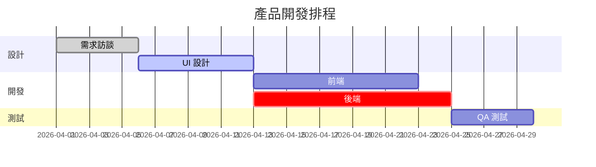

</div>

<div class="grid grid-cols-4 gap-2 text-xs">

<div class="p-2 rounded bg-white/[0.03] border border-white/10">
<code class="text-sky-400">title</code>
<div class="opacity-60 pt-0.5">設定標題</div>
</div>

<div class="p-2 rounded bg-white/[0.03] border border-white/10">
<code class="text-purple-400">dateFormat</code>
<div class="opacity-60 pt-0.5">日期格式</div>
</div>

<div class="p-2 rounded bg-white/[0.03] border border-white/10">
<code class="text-emerald-400">section</code>
<div class="opacity-60 pt-0.5">分組（階段）</div>
</div>

<div class="p-2 rounded bg-amber-500/10 border border-amber-500/30">
<code class="text-amber-300">名稱 :狀態, 別名, 起始, 長度</code>
<div class="opacity-60 pt-0.5">
<span class="text-gray-400">done</span> ·
<span class="text-sky-400">active</span> ·
<span class="text-rose-400">crit</span>
</div>
</div>

</div>

---

# Gantt 時間表達方式

<div class="grid grid-cols-2 gap-6 pt-4">

<div class="space-y-2">

<div class="p-3 rounded-lg bg-white/[0.03] border border-white/10">
<code class="text-amber-300">2026-04-01, 5d</code>
<div class="text-xs opacity-60 pt-1">從 4/1 起算 <b>5 天</b></div>
</div>

<div class="p-3 rounded-lg bg-white/[0.03] border border-white/10">
<code class="text-amber-300">2026-04-01, 2026-04-10</code>
<div class="text-xs opacity-60 pt-1">指定<b>起訖日期</b></div>
</div>

<div class="p-3 rounded-lg bg-white/[0.03] border border-white/10">
<code class="text-amber-300">after d1, 7d</code>
<div class="text-xs opacity-60 pt-1">接在別名 <code>d1</code> 之後 7 天</div>
</div>

<div class="p-3 rounded-lg bg-white/[0.03] border border-white/10">
<code class="text-amber-300">after d1 d2, 3d</code>
<div class="text-xs opacity-60 pt-1">等 <code>d1</code>、<code>d2</code> 都完成再開始</div>
</div>

</div>

<div class="flex items-center">

<div class="p-5 rounded-lg bg-amber-500/[0.05] border border-amber-500/30">
  <ph:lightbulb-duotone class="text-3xl text-amber-400 mb-2" />
  <div class="font-bold text-amber-300 mb-2">別名是甘特圖的靈魂</div>
  <div class="text-sm opacity-70 leading-relaxed">
    用 <code>after 別名</code> 就不用自己算日期，<br>
    只要說「接在前一個任務後面」就好。<br>
    任務時間全部自動連動。
  </div>
</div>

</div>

</div>

---
layout: section
class: text-left
---

<div class="text-rose-400 text-xs tracking-[0.3em] mb-4 font-mono">CHAPTER · 04</div>

# Mindmap &amp; Pie

<div class="text-lg opacity-60 mt-4 font-light">
心智圖與圓餅圖 — 簡單但實用
</div>

<div class="absolute bottom-10 right-10 opacity-20">
  <ph:chart-pie-slice-duotone class="text-[16rem] text-rose-400" />
</div>

---

# Mindmap 心智圖

<div class="text-sm opacity-60 pb-3">靠<b>縮排層級</b>決定階層關係</div>

<div class="grid grid-cols-2 gap-6">

<div class="min-w-0 overflow-hidden p-3 rounded-lg border border-purple-500/30 bg-purple-500/[0.03]">

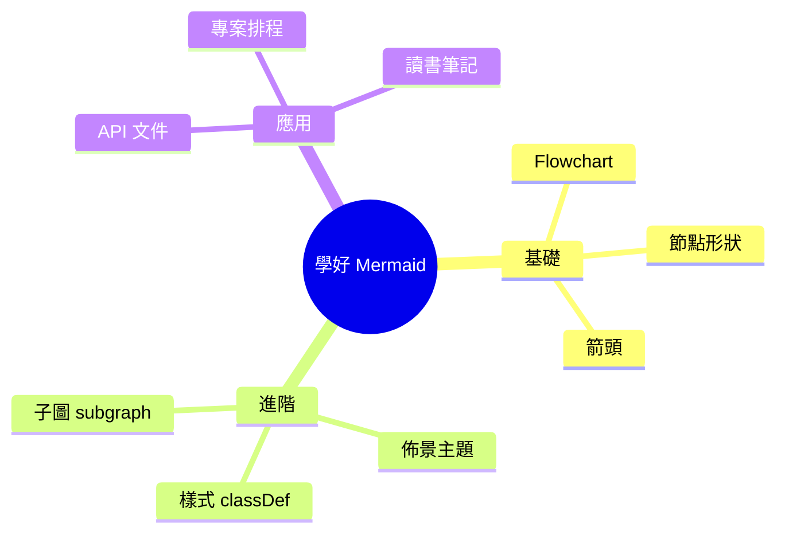

</div>

<div class="space-y-3 text-sm">

<div class="flex gap-3 p-3 rounded-lg bg-white/[0.03] border border-white/10">
  <div class="text-purple-400 font-mono text-xs pt-0.5">01</div>
  <div>第一行 <code>mindmap</code></div>
</div>

<div class="flex gap-3 p-3 rounded-lg bg-white/[0.03] border border-white/10">
  <div class="text-purple-400 font-mono text-xs pt-0.5">02</div>
  <div><code>root((中心主題))</code> — 中心節點</div>
</div>

<div class="flex gap-3 p-3 rounded-lg bg-white/[0.03] border border-white/10">
  <div class="text-purple-400 font-mono text-xs pt-0.5">03</div>
  <div><b>縮排</b> 決定層級（2 空格 = 一層）</div>
</div>

<div class="flex gap-3 p-3 rounded-lg bg-white/[0.03] border border-white/10">
  <div class="text-purple-400 font-mono text-xs pt-0.5">04</div>
  <div>形狀同 Flowchart：<code>[ ]</code>、<code>( )</code>、<code>(( ))</code></div>
</div>

</div>

</div>

---

# Pie 圓餅圖

<div class="text-sm opacity-60 pb-3">最簡單的圖 — 一行標題 + 分類資料</div>

<div class="grid grid-cols-2 gap-6">

<div class="min-w-0 overflow-hidden p-3 rounded-lg border border-rose-500/30 bg-rose-500/[0.03]">

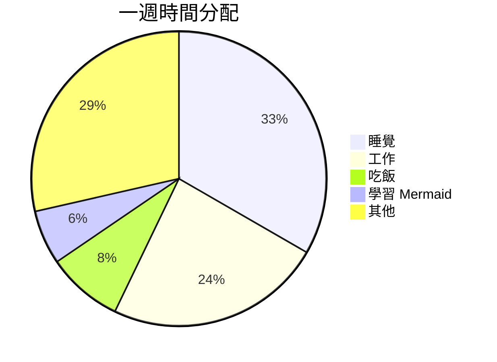

</div>

<div class="space-y-3 text-sm">

<div class="p-3 rounded-lg bg-white/[0.03] border border-white/10">
<div class="font-mono text-xs text-rose-300 pb-1">LINE 1</div>
<code>pie title 標題</code>
</div>

<div class="p-3 rounded-lg bg-white/[0.03] border border-white/10">
<div class="font-mono text-xs text-rose-300 pb-1">DATA</div>
<code>"分類" : 數值</code>
</div>

<div class="p-3 rounded-lg bg-white/[0.03] border border-white/10">
<div class="font-mono text-xs text-rose-300 pb-1">AUTO</div>
Mermaid 會<b>自動算百分比</b>
</div>

<div class="p-3 rounded-lg bg-rose-500/[0.05] border border-rose-500/30">
<div class="font-mono text-xs text-rose-300 pb-1">BONUS</div>
加 <code>showData</code> 顯示實際數字：<br>
<code>pie showData title ...</code>
</div>

</div>

</div>

---
layout: section
class: text-left
---

<div class="text-orange-400 text-xs tracking-[0.3em] mb-4 font-mono">TIPS</div>

# 實戰技巧

<div class="text-lg opacity-60 mt-4 font-light">
初學者最常踩的雷
</div>

<div class="absolute bottom-10 right-10 opacity-20">
  <ph:warning-duotone class="text-[16rem] text-orange-400" />
</div>

---

# 常見錯誤 Top 5

<div class="space-y-2 pt-2">

<v-clicks>

<div class="flex gap-4 items-start p-3 rounded-lg bg-white/[0.03] border border-red-500/20">
  <div class="font-mono text-red-400 text-2xl font-bold shrink-0 w-8">01</div>
  <div class="flex-1 pt-1">
    <div class="font-bold text-red-300">第一行忘了寫圖表類型</div>
    <div class="text-xs opacity-60">一定要以 <code>graph</code> / <code>gantt</code> / <code>mindmap</code> / <code>pie</code> 開頭</div>
  </div>
</div>

<div class="flex gap-4 items-start p-3 rounded-lg bg-white/[0.03] border border-red-500/20">
  <div class="font-mono text-red-400 text-2xl font-bold shrink-0 w-8">02</div>
  <div class="flex-1 pt-1">
    <div class="font-bold text-red-300">節點 ID 重複</div>
    <div class="text-xs opacity-60"><code>A[登入] --> A[登出]</code> 會被視為同一個節點，改用不同 ID</div>
  </div>
</div>

<div class="flex gap-4 items-start p-3 rounded-lg bg-white/[0.03] border border-red-500/20">
  <div class="font-mono text-red-400 text-2xl font-bold shrink-0 w-8">03</div>
  <div class="flex-1 pt-1">
    <div class="font-bold text-red-300">中文用到全形標點</div>
    <div class="text-xs opacity-60">節點內的括號、逗號請用<b>半形</b>，否則解析失敗</div>
  </div>
</div>

<div class="flex gap-4 items-start p-3 rounded-lg bg-white/[0.03] border border-red-500/20">
  <div class="font-mono text-red-400 text-2xl font-bold shrink-0 w-8">04</div>
  <div class="flex-1 pt-1">
    <div class="font-bold text-red-300">Gantt 沒寫 dateFormat</div>
    <div class="text-xs opacity-60">最穩寫法：<code>dateFormat YYYY-MM-DD</code></div>
  </div>
</div>

<div class="flex gap-4 items-start p-3 rounded-lg bg-white/[0.03] border border-red-500/20">
  <div class="font-mono text-red-400 text-2xl font-bold shrink-0 w-8">05</div>
  <div class="flex-1 pt-1">
    <div class="font-bold text-red-300">圖太大切到畫面外</div>
    <div class="text-xs opacity-60">加 <code>{scale: 0.6}</code> 縮小，或改用 <code>graph LR</code> 橫向排</div>
  </div>
</div>

</v-clicks>

</div>

---

# 繼續學習的資源

<div class="grid grid-cols-2 gap-4 pt-4">

<a href="https://mermaid.js.org" target="_blank" class="group p-5 rounded-lg bg-white/[0.03] border border-sky-500/30 no-underline transition hover:border-sky-400">
  <ph:book-open-duotone class="text-3xl text-sky-400 mb-2" />
  <div class="font-bold text-lg">官方文件</div>
  <div class="text-xs opacity-60 font-mono">mermaid.js.org</div>
  <div class="text-xs opacity-50 mt-2">最完整的語法參考</div>
</a>

<a href="https://mermaid.live" target="_blank" class="group p-5 rounded-lg bg-white/[0.03] border border-purple-500/30 no-underline transition hover:border-purple-400">
  <ph:flask-duotone class="text-3xl text-purple-400 mb-2" />
  <div class="font-bold text-lg">Live Editor</div>
  <div class="text-xs opacity-60 font-mono">mermaid.live</div>
  <div class="text-xs opacity-50 mt-2">邊寫邊看結果，最快上手</div>
</a>

<div class="p-5 rounded-lg bg-white/[0.03] border border-amber-500/30">
  <ph:puzzle-piece-duotone class="text-3xl text-amber-400 mb-2" />
  <div class="font-bold text-lg">VSCode 外掛</div>
  <div class="text-xs opacity-60 font-mono">Markdown Preview Mermaid Support</div>
  <div class="text-xs opacity-50 mt-2">在 VSCode 直接預覽</div>
</div>

</div>

<div class="pt-6 text-xs opacity-60 text-center flex items-center justify-center gap-2">
  <ph:lightbulb-duotone />最快的學法：打開 Live Editor，把今天的範例貼進去，亂改一通
</div>

---
layout: quote
class: text-center
---

<div class="text-3xl font-light leading-relaxed max-w-4xl mx-auto">
用<span class="text-teal-400 font-medium">文字</span>畫圖的好處，<br>
不是讓圖變漂亮，<br>
而是讓你能<span class="text-amber-300 font-medium">專注在內容本身</span>。
</div>

<div class="text-xs opacity-40 mt-10 tracking-widest uppercase font-mono">
— Why Mermaid
</div>

---
layout: end
class: text-center
---

<div class="absolute inset-0 bg-[#0b1220]"></div>

<div class="relative z-10">

<div class="flex justify-center mb-6">
  <ph:check-circle-duotone class="text-7xl text-teal-400" />
</div>

<div class="text-5xl font-bold text-slate-100">
謝謝聆聽
</div>

<div class="text-base opacity-60 pt-4 font-light">
現在你已經會用<b class="text-teal-300">文字</b>畫圖了
</div>

<div class="pt-12 inline-block">
  <div class="p-5 rounded-lg bg-white/[0.03] border border-white/10">
    <div class="flex items-center gap-2 text-xs opacity-50 tracking-[0.3em] uppercase mb-2 font-mono justify-center">
      <ph:notepad-duotone />今日作業
    </div>
    <div class="text-base">用 Mermaid 畫出你今天一整天的行程</div>
  </div>
</div>

</div>
